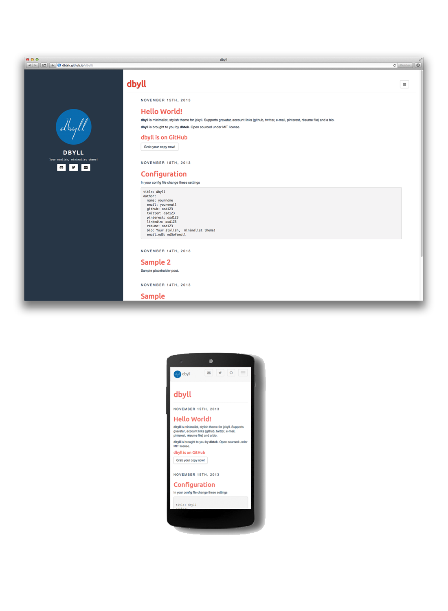

dbyll
=====

Open source stylish, minimalistic theme for jekyll.  
Demo: http://dbtek.github.io/dbyll/

## New
Dbyll for Ghost is now available. Get it [here](https://github.com/dbtek/dbyll-ghost) now.

### Features
- Responsive layout.
- Supports tags and categories.
- Social profile and bio of author.
- Bootstrap based.
- Glyphicon and Font-Awesome Icons.
- Pagination.
- Syntax highlighting with pygments.
- Disqus comments.

### Download
* [Download dbyll](https://github.com/dbtek/dbyll/archive/master.zip)

### Screenshots

### License
- [MIT](http://opensource.org/licenses/MIT)

