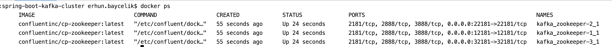
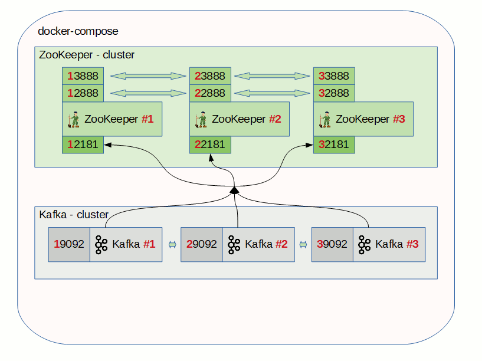

Apache Kafka is described itself as "distributed commit log" or more recently "distributing streaming platform". Kafka brokers 
can work together in a group to provide distributed environment which called as cluster.   

# Introduction

In this post we will run multiple kafka brokers in a cluster. We will use our local environment to test the changes 
easily in the future. The goal of this blog post is build an cluster environment in the local and then test some distributed
functionality of kafka brokers easily in the local. 

# Configuration  

This project contains two docker-compose files, one of them is for apache zookeeper, apache kafka and kafka-manager. Other docker compose file contains two projects as producer and consumer. 
Also it has postgres images too which is used by consumer. Let's start with kafka configurations


## Zookeeper configuration

In below configuration first zookeeper nodes are configured. Zookeeper use port 2888 and 3888 for internal cluster communication and expose 2181 for external client communication.
Because we are configuring all three nodes in same server I added 1, 2, 3 as a suffix to all zookeeper servers port configuration to prevent port collision.
The #2888 ports are used for peers communication and the #3888 ports are used for leader elections. More about you can find in the [official ZooKeeper documentation](https://zookeeper.apache.org/doc/current/zookeeperStarted.html).

```yaml
version: '3.7'
services:
  zookeeper-1:
    image: confluentinc/cp-zookeeper:latest
    hostname: zookeeper-1
    ports:
      - "12181:12181"
    environment:
      ZOOKEEPER_SERVER_ID: 1
      ZOOKEEPER_CLIENT_PORT: 12181
      ZOOKEEPER_TICK_TIME: 2000
      ZOOKEEPER_INIT_LIMIT: 5
      ZOOKEEPER_SYNC_LIMIT: 2
      ZOOKEEPER_SERVERS: zookeeper-1:12888:13888;zookeeper-2:22888:23888;zookeeper-3:32888:33888

  zookeeper-2:
    image: confluentinc/cp-zookeeper:latest
    hostname: zookeeper-2
    ports:
      - "22181:22181"
    environment:
      ZOOKEEPER_SERVER_ID: 2
      ZOOKEEPER_CLIENT_PORT: 22181
      ZOOKEEPER_TICK_TIME: 2000
      ZOOKEEPER_INIT_LIMIT: 5
      ZOOKEEPER_SYNC_LIMIT: 2
      ZOOKEEPER_SERVERS: zookeeper-1:12888:13888;zookeeper-2:22888:23888;zookeeper-3:32888:33888

  zookeeper-3:
    image: confluentinc/cp-zookeeper:latest
    hostname: zookeeper-3
    ports:
      - "32181:32181"
    environment:
      ZOOKEEPER_SERVER_ID: 3
      ZOOKEEPER_CLIENT_PORT: 32181
      ZOOKEEPER_TICK_TIME: 2000
      ZOOKEEPER_INIT_LIMIT: 5
      ZOOKEEPER_SYNC_LIMIT: 2
      ZOOKEEPER_SERVERS: zookeeper-1:12888:13888;zookeeper-2:22888:23888;zookeeper-3:32888:33888

```

Now you may want to test just zookeeper servers. First define the hostname in your local host file. It should be look as below.

```
127.0.0.1	localhost

127.0.0.1 zookeeper-1 zookeeper-2 zookeeper-3

```

Now if you run below docker-compose.yml with ```docker-compose up``` command. After containers are up and running you can check containers name
via ```docker ps```.



Because docker-compose file is in kafka folder, default network name is kafka and it added all images name as a default suffix. So
our image names are kafka_zookeeper_1_1, kafka_zookeeper_2_1, kafka_zookeeper_3_1. Let's connect to kafka_zookeeper_1_1.
```docker exec -it docker_zookeeper-1_1 bash```. Now we should be connect to the docker container which is running zookeeper. 
``` zookeeper-shell 127.0.0.1:12181 ``` with  this command we can connect zookeeper server and run below commands to list root, brokers, topics, consumers.

```
ls /
ls /brokers
ls /brokers/topics
ls /consumers
``` 

## Kafka configuration

## Configure KafkaCat Tool 


```java


```
 

# How to run the project


# Result



You can find the all project [on Github](https://github.com/muzir/softwareLabs/tree/master/spring-boot-kafka-cluster)

# References

https://better-coding.com/building-apache-kafka-cluster-using-docker-compose-and-virtualbox/

Happy coding :) 
